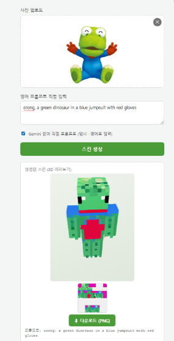

# 마크 스킨생성기 🎮

캐릭터 **이미지** 또는 **텍스트 아이디어**를 입력하면, 게임에 바로 업로드 가능한 **64×64 마인크래프트 스킨 PNG**를 생성한다. (졸업작품)



## ✨ 기능
- 텍스트 아이디어 또는 캐릭터 사진(드래그앤드롭) 입력
- Gemini가 입력을 SDXL용 영어 프롬프트로 변환
- 로컬 GPU의 SDXL이 64×64 스킨 생성 → 형식 자동 검증
- **3D 미리보기**로 게임 속 모습 확인 + **PNG 다운로드**
- 임시: Gemini 없이 영어 프롬프트 직접 입력 모드

## 🔧 동작 방식
```
입력(텍스트/이미지) → ① 프롬프트 생성(Gemini) → ② 스킨 생성(SDXL) → ③ 검증 → ④ 웹 UI
```
| 단계 | 역할 | 파일 |
|---|---|---|
| ① | 입력 → 영어 프롬프트 | `backend/prompt_skill.py` |
| ② | 프롬프트 → 64×64 스킨 (로컬 GPU) | `backend/sdxl_skin.py` |
| ③ | 형식 검증 (64×64·RGBA·투명) | `backend/mc_skin_generator.py` |
| ④ | 입력·결과·다운로드 | `frontend/` + `backend/main.py` |

## 🚀 실행

### 사전 준비
- Python 3.12, Node 18+, NVIDIA GPU(VRAM 8GB+)
- `backend/.env` 에 키 입력 (`backend/.env.example` 참고):
  ```
  GEMINI_API_KEY=발급받은_키
  ```

### 백엔드 (가상환경)
```bash
py -3.12 -m venv .venv
.venv\Scripts\activate
pip install torch --index-url https://download.pytorch.org/whl/cu121
pip install diffusers transformers accelerate safetensors
pip install -r backend/requirements.txt
```

### 프론트엔드
```bash
cd frontend && npm install
```

### 동시 실행 (Windows)
```bash
dev.bat
```
→ 백엔드 `:8000`, 프론트 `:5173`. 브라우저에서 http://localhost:5173 접속.

## 📁 구조
```
backend/
  prompt_skill.py      # ① Gemini 프롬프트 생성
  sdxl_skin.py         # ② SDXL 스킨 생성 래퍼
  mc_skin_generator.py # ③ validate_skin + UV 좌표
  main.py              # ④ FastAPI 서버
frontend/              # ④ React 웹 UI
docs/                  # 문서
dev.bat                # 백+프론트 동시 실행
```

## 📄 문서
- [아키텍처](docs/architecture.md) — 시스템 구조·데이터 흐름
- [설계 결정](docs/design.md) — 왜 이렇게 만들었나
- [체크리스트](docs/checklist.md) — 진행 상황
- [Git 규칙](docs/git.md) — 커밋 컨벤션

## ⚖️ 라이선스
② 스킨 생성 모델 `monadical-labs/minecraft-skin-generator-sdxl` 및 원본 레포는 **GPL-3.0**. 배포 시 소스 공개 의무 및 모델 가중치 라이선스 별도 확인 필요.
